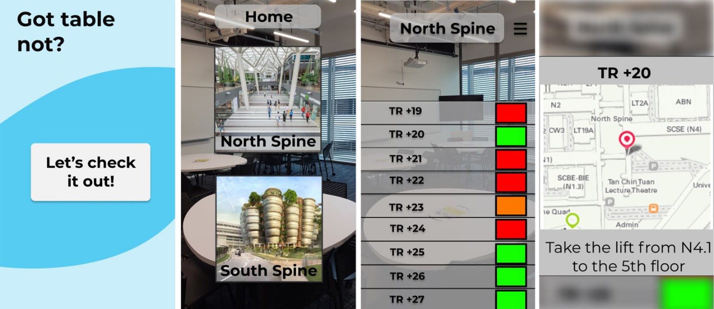

# PythonRiders NTU IEEE Hackathon 
MELVYN, WEI HENG, RANDY

**PROBLEM SCENARIO**
- Students spend a great deal of time finding tutorial rooms to study
- Inefficient usage of time and effort spend

**SOLUTION**
- Using caffe model for motion detection to register inflow and outflow of students
- NTU students access the app to check the amount of people in the tutorial rooms
- Different colour light indicators:
  - Red = Close to full/Used for lessons(>0.6)
  - Amber = Moderately full (0.1-0.6)
  - Green = Empty(<0.1)

**WORKING PRINCIPLE**
- A Raspberry Pi camera is installed at the top edge of the tutorial door
- Students passing through the blue line in one direction will add an increment to the counter while the opposite direction will register a decrement counter
- Number of students passing through will also be recorded(green box)
- Colour indicator will be reflected according to the number in counter

**FURTHER IMPROVEMENTS**
- Pre-existing users might leave the room for a while to use the toilets/buy food
- Proposed model does not detect hogging of seats

**Installed libraries:**

  - django
  - crispy-form
  - pip install django-multiselectfield
  - pip install django-session-timeout
  - pip install notify-run

**Path where manage.py resides:**
  - C:\Users\User\Documents\GitHub\ieeeHackathon_PythonRiders\ProjectName

**View list of django-admin commands:**
  - django-admin

**Create new website:**
  - django-admin startproject ProjectName

**To run the web application on your local machine** -->    *localhost:8000 or 127.0.0.1:8000*

**Every changes to model, run the following in order:**
1)	python manage.py makemigrations	(Create the migrations (generate the SQL commands))
2)	python manage.py migrate	(Run the migrations (execute the SQL commands))

**TO START THE WEB APP:**
1)	python manage.py  runserver

**External Resources**
  - Create Markdown files fast with user-friendly GUI --> https://dillinger.io/
  - Build a protoype GUI --> https://www.figma.com/files/recent

> The overriding design goal for Markdown's
> formatting syntax is to make it as readable
> as possible. The idea is that a
> Markdown-formatted document should be
> publishable as-is, as plain text, without
> looking like it's been marked up with tags
> or formatting instructions.

This text you see here is *actually* written in Markdown! To get a feel for Markdown's syntax, type some text into the left window and watch the results in the right.

| Plugin | README |
| ------ | ------ |
| Dropbox | [plugins/dropbox/README.md][PlDb] |
| Github | [plugins/github/README.md][PlGh] |
| Google Drive | [plugins/googledrive/README.md][PlGd] |
| OneDrive | [plugins/onedrive/README.md][PlOd] |
| Medium | [plugins/medium/README.md][PlMe] |
| Google Analytics | [plugins/googleanalytics/README.md][PlGa] |

